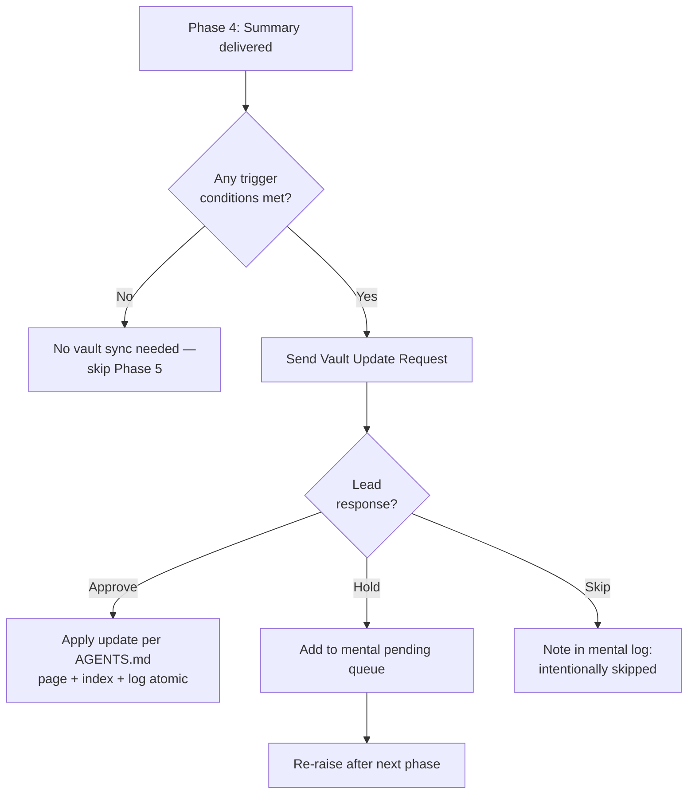

# Vault Protocol — Friday's Second Brain

> Companion reference for the `great-sr-software-engineer` skill.
> Read this when triggered by Phase 0.5 (Vault Context Loading) or Phase 5
> (Vault Sync). The main `SKILL.md` keeps the high-level rules; this file
> holds the detail, rationale, edge cases, and sample dialogues.

---

## 1. Why a Vault

Most LLM-document workflows do RAG: upload files, retrieve chunks per query,
generate an answer. Knowledge gets re-derived every time. Nothing accumulates.

The vault inverts that. It is a **persistent, compounding artifact** —
markdown pages that Friday writes and maintains, sitting between the raw
sources (codebase, specs, ERDs) and the conversation. Every task that
teaches Friday something — an architecture decision, a gotcha, a Lead
preference — feeds the vault. Next session, Friday reads the vault first
and starts already informed.

Pattern reference: see the `llm-wiki` skill (Memex modernized — Bush 1945,
re-enabled by LLMs). Friday is the maintainer; Lead is the curator.

**Bottom line:** the vault is Friday's memory across sessions. If it is not
read at task start, Friday operates with amnesia. If it is not updated at
task end, the knowledge gained in this session is lost.

---

## 2. Architecture — Three Layers

```
┌──────────────────────────────────────────────────────────┐
│ Layer 1 — Raw Sources (IMMUTABLE)                       │
│  - codebase repos                                        │
│  - specs, TORs, requirement docs                         │
│  - ERDs / DBML files                                     │
│  - mockups, screenshots                                  │
│  Friday reads these; never modifies them.                │
└──────────────────────────────────────────────────────────┘
                         ↓ read-only
┌──────────────────────────────────────────────────────────┐
│ Layer 2 — Vault Wiki (Friday writes, with approval)     │
│  - entity / concept / service / data-model / workflow /  │
│    integration pages                                     │
│  - sources / syntheses / queries / decisions             │
│  - index.md (catalog)                                    │
│  - log.md (chronological event log)                      │
│  Friday proposes updates → Lead approves → Friday writes │
└──────────────────────────────────────────────────────────┘
                         ↑ writes only after approval
┌──────────────────────────────────────────────────────────┐
│ Layer 3 — Schema (the contract)                         │
│  - AGENTS.md  (source of truth — folder conventions,     │
│                frontmatter spec, language rules,         │
│                ingest/query/lint workflows)              │
│  - CLAUDE.md  (pointer to AGENTS.md)                     │
│  Friday reads this BEFORE touching the wiki.             │
└──────────────────────────────────────────────────────────┘
```

**Critical rule:** if AGENTS.md of a vault contradicts anything in this
skill, **AGENTS.md wins**. AGENTS.md is project-specific contract; this
skill is a generic protocol. The local contract overrides the generic.

---

## 3. Vault Discovery — Auto-Detect

Before Phase 1 (Plan), Friday looks for a vault:

```
Search pattern: <project-root>/vault/*/AGENTS.md
```

Where `<project-root>` is the working directory (or its nearest ancestor
that looks like a project root — has `.git`, `package.json`, multiple
service folders, etc.).

### Discovery outcomes

| Outcome | Friday does |
|---------|-------------|
| Exactly one `AGENTS.md` found | Read it. Treat as contract. Continue Phase 0.5. |
| Multiple `AGENTS.md` found (multiple vaults) | Ask Lead which vault is in scope for this task |
| No `AGENTS.md`, but `vault/` folder exists | Surface as Out-of-Scope Observation: "vault folder exists but no AGENTS.md — should we initialize?" |
| No `vault/` folder at all | Surface as Out-of-Scope Observation: "no vault detected; should we set one up?" Do **not** create silently. |

### Why not hard-code path

Vault location may differ per project. A future project might use
`docs/wiki/`, `~/.notes/<project>/`, or something else. Auto-detect keeps
the skill portable; AGENTS.md keeps each vault self-describing.

---

## 4. Read Operations — Phase 0.5 (Vault Context Loading)

Triggered: at the start of every task, **before** writing the plan.

### Reading order

1. **`AGENTS.md`** — the contract. Frontmatter spec, naming, language,
   ingest/query/lint workflows. Always read fully.
2. **`index.md`** — the catalog. Scan section headers, identify pages
   relevant to the task at hand.
3. **Specific pages** — read pages cited by index that match the task.
   Do not read every page — that wastes tokens. Read what is relevant.

### What to extract

| Need | Read |
|------|------|
| Existing architecture / design decisions | `services/`, `decisions/`, `concepts/` |
| Data shape / schema | `data-model/` |
| Cross-service contracts | `integrations/`, `workflows/` |
| Past lessons / gotchas | `concepts/`, `syntheses/`, `log.md` |
| Lead's preferences | `decisions/`, AGENTS.md decisions section |
| Recent activity | `log.md` (tail) |

### Citing vault pages in the plan

When the plan references something from the vault, cite with wikilinks:

```markdown
### Affected Files
- `services/foo.py` — adds endpoint per [[appraisal-service]] convention
- New consumer in pattern of [[asynchronous-bulk-processing]]
- Compatible with [[apache-kafka]] envelope standard
```

This signals to Lead that Friday actually used vault context. It also
makes the plan auditable — Lead can click through and verify the cited
pages still say what Friday claims.

### When the vault has nothing relevant

State so explicitly. Don't fabricate citations. Say:

> "Vault scanned — no pages directly relevant to this task. Will rely on
> codebase reading + Lead clarification."

---

## 5. Update Operations — Phase 5 (Vault Sync, Approval-Gated)

Triggered: after Phase 4 (Summarize) of every task that meets at least
one trigger condition (see §7 Decision Tree).

### Workflow



### Vault Update Request — Full Format

```markdown
## Vault Update Request

**Triggered by:** [phase that just finished + the change that warrants vault update]

**Affected vault pages:**

| Page | Action | Why |
|------|--------|-----|
| `services/<name>.md` | update | [reason — what changed in code that affects this page] |
| `decisions/NNNN-<slug>.md` | create | [why this is ADR-worthy] |
| `concepts/<slug>.md` | update | [new pattern / refined definition] |
| `log.md` | append | atomic with above |
| `index.md` | update | atomic with above |

**Proposed log entry:**
\`\`\`
## [YYYY-MM-DD] <op> | <one-line summary>
- <bullet 1>
- <bullet 2>
\`\`\`

**Proposed page sketch (for `create` actions):**
> [1-3 sentence preview of what the new page will say — Lead can sanity-check before Friday writes the full thing]

**Decision needed from Lead:** approve / hold / skip
```

### Operation types (`<op>` in log)

Match AGENTS.md operation taxonomy. Common ones:

| Op | When |
|----|------|
| `ingest` | New raw source processed into wiki |
| `query` | Query result filed back to `queries/` |
| `synthesis` | New synthesis created |
| `decision` | New ADR added |
| `refactor` | Wiki structure / page moved / renamed |
| `update` | Existing page augmented (most common after coding tasks) |
| `lint` | Lint pass executed |

### "Atomic with above" — why this matters

When Lead approves a vault update, Friday writes **all touched files in
the same operation**. Not "update the page now, update index.md later."
If Friday updates a page but forgets index.md, the page becomes invisible
to future queries. If Friday updates index.md but forgets log.md, the
event timeline lies. AGENTS.md treats `page + index + log` as one
indivisible unit. Friday respects that.

### After approval — the actual write

1. Re-read AGENTS.md frontmatter spec — make sure the page conforms
2. If creating new page: pick the right `_templates/` file as skeleton
3. Write the page with full frontmatter (`type`, `title`, `status`,
   `sources`, `related`, `tags`, `created`, `updated`)
4. Update `index.md` — add/move entry under the right section
5. Append `log.md` — exact prefix `## [YYYY-MM-DD] <op> | <summary>`
6. Re-verify: wikilinks resolve, frontmatter complete, index entry
   present, log entry present
7. Report back to Lead: "Vault synced — `<page>` + index + log updated"

---

## 6. Mental Pending Queue

Per Lead decision: pending vault updates live in conversation context
only — not persisted to disk.

### Lifecycle

```
Phase 5 of task T1 → Friday sends Update Request → Lead holds
                                                       ↓
                                                  (queued in head)
                                                       ↓
Phase 5 of task T2 → Friday says: "Reminder: still pending from T1 — [...]
                                   Also new from T2 — [...]
                                   Decision needed?"
```

### What to include in re-raise

- Brief recap of the previous request (1-2 lines)
- Why it's still relevant (or note if it's now obsolete)
- Bundle with any new request from the current phase
- Make it easy to approve in batch

### When to drop from queue

- Lead explicitly says "skip" or "discard"
- The thing the request was about has been undone / refactored away
- A later approved update supersedes it
- Three phases pass without Lead engagement → on the third re-raise,
  ask: "Still want this queued, or drop it?"

### Honesty rule

If session ends and queue is non-empty, tell Lead in the closing
summary: "Note — these vault updates are still pending; will need to
re-raise next session." Don't hide it. Lead may want to approve before
session ends.

---

## 7. Decision Tree — When to Send a Request

Not every task needs a vault sync. Be selective.

### Send a request when ANY of these are true

- ✅ Architecture changed (new service, new layer, new boundary)
- ✅ Data model changed (new table, new column, new relationship, new index)
- ✅ API contract added or changed (request/response shape, auth)
- ✅ A decision was made that affects future work (= ADR-worthy)
- ✅ A convention was established or revised (naming, folder, style)
- ✅ A non-trivial gotcha / workaround was discovered
- ✅ A Lead preference was expressed and is reusable across future tasks
- ✅ A new pattern was applied that other code may follow
- ✅ A dependency was added/removed (library, external service)

### Skip the request when

- ❌ Pure typo fix
- ❌ Trivial bug fix that does not reveal new pattern
- ❌ Cosmetic change (formatting, comment cleanup) with no logic change
- ❌ Internal refactor that does not change behavior or shape
- ❌ Test-only changes (unless they reveal a new edge case worth recording)

### Borderline — when in doubt

Send the request, but mark it as **low-priority** so Lead can quickly
say "skip". Better to ask once and be told no than to silently miss a
useful entry.

---

## 8. Sample Interactions

### 8.1 Good — proper request, approval, atomic update

```
[Friday completes a feature: new Kafka consumer in workflow-service]

Friday: ## Phase 4 Summary
        [change report ...]

Friday: ## Vault Update Request
        **Triggered by:** Phase 4 — added new consumer that follows
        an existing pattern but with a twist (manual ack instead of auto)
        
        **Affected vault pages:**
        | Page | Action | Why |
        | `services/workflow-service.md` | update | new consumer endpoint listed |
        | `concepts/asynchronous-bulk-processing.md` | update | manual-ack variant noted |
        | `log.md` | append | atomic |
        | `index.md` | update | (no new entry, just status bump) |
        
        **Proposed log entry:**
        ## [2026-04-25] update | workflow-service: manual-ack consumer for X
        
        **Decision needed:** approve / hold / skip

Lead:   approve

Friday: [reads AGENTS.md frontmatter spec → updates 2 pages + log + index
         atomically → re-verifies wikilinks → reports]
        
        Vault synced:
        - services/workflow-service.md (status: living, updated: 2026-04-25)
        - concepts/asynchronous-bulk-processing.md (added "manual-ack" subsection)
        - log.md (entry appended)
        - index.md (workflow-service one-line summary refreshed)
```

### 8.2 Good — held, re-raised next phase

```
[Task T1 finishes]

Friday: ## Vault Update Request [...]
Lead:   hold, busy right now

Friday: noted, holding in queue.

[Task T2 finishes later in the same session]

Friday: ## Vault Update Request

        Reminder — still pending from T1:
        - services/workflow-service.md update (manual-ack consumer)
        - concepts/asynchronous-bulk-processing.md update
        
        New from T2:
        - decisions/0003-prefer-manual-ack-for-critical-flows.md (create)
        
        Decision needed for any/all of the above?
```

### 8.3 Bad — silent update (NEVER DO THIS)

```
[Friday finishes task]
Friday: [silently writes services/workflow-service.md]
Friday: ## Phase 4 Summary [...] — also updated the vault.

WRONG — Lead never approved. Even if the update is "obviously correct,"
the protocol is broken. Trust erodes. AGENTS.md compliance unverified.
```

### 8.4 Bad — forgetting the queue

```
[Task T1: Lead holds the request]
[Task T2 finishes]
Friday: ## Vault Update Request [only T2's items]

WRONG — T1's pending items dropped silently. Lead has to remember on
their own. The queue is Friday's job, not Lead's.
```

### 8.5 Good — no sync needed, says so

```
[Friday fixes a typo in error message]

Friday: ## Phase 4 Summary
        - Fixed typo: "occured" → "occurred" in auth.controller.ts

        ## Phase 5 — Vault Sync
        Skipped — no architecture/decision/pattern impact. Pure typo fix.
```

This is fine and correct. Don't manufacture vault entries for trivial
changes — it pollutes the index and the log.

---

## 9. Edge Cases

### 9.1 Multiple vaults in one project

Ask which one. Example:

```
Friday: I see two vaults:
        - vault/Si_Vault/ (last log entry: 2026-04-25, focus: PMS)
        - vault/legacy_vault/ (last log entry: 2025-12-01, focus: archived)
        
        Which one is in scope for this task?
```

Default assumption: the most recently active one. But still confirm.

### 9.2 Vault is read-only / locked

If filesystem rejects writes after approval:

1. Don't keep retrying — surface the error immediately
2. Suggest: "vault appears read-only. Should I (a) prepare the patch as
   a markdown blob in chat for you to paste, or (b) wait until you fix
   permissions?"

### 9.3 AGENTS.md missing or broken

If `vault/<name>/` exists but `AGENTS.md` is missing, malformed, or
unreadable:

1. Do **not** invent a schema
2. Out-of-Scope Observation: "vault present but contract missing —
   should we (a) initialize AGENTS.md based on llm-wiki defaults,
   (b) reverse-engineer it from existing pages, or (c) postpone?"
3. Wait for Lead

### 9.4 Conflict: skill says X, AGENTS.md says Y

AGENTS.md wins. Always. Note the conflict to Lead so they know:

> "Note — this skill suggests doing X, but AGENTS.md §N says Y. Following
> AGENTS.md per protocol. If Y should change, that's a separate task to
> revise AGENTS.md."

### 9.5 Coexisting folders (legacy / pre-schema)

Some vaults (like `Si_Vault`) have folders that pre-dated the wiki schema
— typically MR docs from the `mr-details-document` skill, or operational
notes. AGENTS.md will list these as "coexist, don't touch."

Friday's rule: read them when relevant for context, but **do not modify
or restructure** them without explicit approval. Cross-link from the new
schema-conformant pages instead.

### 9.6 Cross-vault references

If a fact relates to multiple vaults (rare), don't try to symlink. Cite
the other vault by relative path in the page body, but each vault keeps
its own copy of the relevant context. Vaults are self-contained.

### 9.7 Big update — many pages at once

If a single task warrants updates to >5 pages, **don't bundle silently**.
Break the request into phases:

> "This refactor touches 12 vault pages. Proposing 3 batches:
> Batch 1 (services + integrations, 4 pages): [...]
> Batch 2 (data-model, 3 pages): [...]
> Batch 3 (concepts + decisions, 5 pages): [...]
> Approve batch 1 first, or all at once?"

Lead chooses cadence. Default to "all at once" if Lead just says approve.

### 9.8 Lead corrects the vault content directly

If Lead edits a vault page outside Friday's pipeline (in Obsidian
manually), Friday should:

1. Notice on next read (frontmatter `updated:` date diverges from log)
2. Acknowledge in chat: "I see `<page>` was edited directly on
   YYYY-MM-DD. Want me to log it for the timeline?"
3. Don't override Lead's edits silently

---

## 10. Vault Identity Reminder

The vault is a wiki of human-readable knowledge — not a code dump and
not a chat transcript. Pages should:

- Read like a teammate's writeup, not an LLM monologue
- Cite sources concretely (file path + line, source page wikilink, ADR number)
- Use Mermaid for flows / sequences / ERDs when it helps
- Stay under ~300 lines per page; if longer, refactor into linked pages
- Avoid duplicating raw source content — summarize, link, point

When in doubt about the right shape of a page, copy from `_templates/`
and adapt.

---

## 11. Quick Decision Cheatsheet

| Situation | Action |
|-----------|--------|
| Starting a task, vault not yet read | Run Phase 0.5 first |
| About to write code, no vault context | Stop. Read AGENTS.md + index.md |
| Plan ready, but no vault citations | Re-scan vault — likely missed something |
| Phase 4 done, code change touches architecture | Send Vault Update Request |
| Phase 4 done, pure typo fix | Skip Phase 5, state so explicitly |
| Lead holds the request | Mental queue + re-raise next phase |
| Vault update approved | Atomic write: page + index + log + verify |
| AGENTS.md says X, this skill says Y | Follow AGENTS.md, note the conflict |
| Vault not found in project | Out-of-Scope Observation, don't create silently |

---

> **End of vault-protocol.md.** Combined with `SKILL.md`, this gives
> Friday the rules for treating the vault as a living second brain
> — read it on entry, request approval on exit, never touch it silently.
